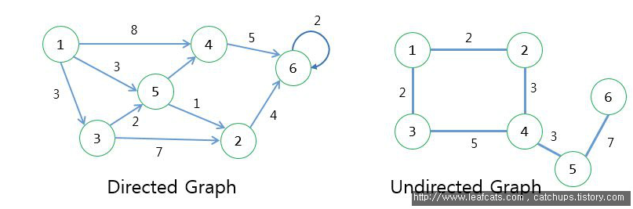

# 트리와 그래프

- 트리나 그래프는 배열이나 연결리스트처럼 선형으로 구성된 자료구조에서 탐색하는 것보다 훨씬 까다롭다.
- 최악의 수행 시간과 평균적 수행시간이 매우 크게 바뀔 수 있어서, ***알고리즘을 생각할 때 2가지 모두 따져봐야한다.***

### - 면접 Tip -

>1. 책에 나온 용어들이 다른 책들과 살짝 다를 수 있다. 따라서, ***면접 시에는 면접관에게 모호할 수 있는 용어는 먼저 정리를 해주어야 한다.***
>2. 트리 및 그래프 문제들은 대부분 세부사항이 모호하거나 가정 자체가 틀리는 경우가 많기 때문에, 필요하면 명확하게 해줄 것을 요구하자

# 트리

트리를 이해하기 위한 좋은 방법은 **재귀적 설명법**을 사용하는 것이다.

1. 트리는 하나의 루트 노드를 갖는다
2. 루트 노드는 **0개 이상**의 자식노드를 갖는다.
3. 그 자식 노드 또한 **0개 이상**의 자식노드를 갖고 있고, 이는 반복적으로 정의된다.

## 특징

- 그래프의 한 종류이다.
- **싸이클이 존재할 수 없는 하나의 연결 그래프이다.**
- 노드들은 특정 순서로 나열될 수도 있고 그럴 수 없을 수도 있다.
- 부모 노드로의 연결이 있을 수도 있고 없을 수도 있다. (자식이 없는 노드는 **말단 노드**라고한다.)

## 트리 vs 이진 트리

### 이진 트리(binary tree)

- 각 노드가 ***최대 두 개의 자식을 갖는 트리***를 말한다.
- 모든 트리는 이진 트리가 아니고, 최대 자식의 노드 개수에 따라 이진트리, 삼진트리.. 이렇게 이름이 달라진다.

### 이진 탐색 트리

이진 탐색 트리는 다음과 같은 특정 순서를 따른다.

- '**모든 왼쪽 자식들 ≤ n < 모든 오른쪽 자식들**' 속성은 모든 노드 n에 대하서 반드시 참이다.

### - 면접 Tip -

> 1. 같은 값을 처리하는 방식에 따라 이진 탐색 트리의 정의가 약간씩 달라질 수 있으므로 면접관에게 미리 명확히 이야기해줄 필요가 있다.
> 2. 면접시 트리가 주어지면 이진 탐색 트리인지 아닌지 확실히 묻자

## 균형 vs 비균형

- **균형 트리는 왼쪽과 오른쪽 부분 트리의 크기가 완전히 같게 하는 것을 의미하지 않는다.**
- 균형 트리인지 아닌지 확인하는 방법 중 하나는 '**너무 불균형한건 아닌지**' 확인하는 것 이상의 의미를 갖는다.
    - O(logN) 시간에 find, insert 할 수 있을 정도로 균형이 잡혀 있으면 된다.

### - 면접 Tip -

> 균형 트리인지 비균형 트리인지 확실히 묻자

## 완전 이진 트리

- 트리의 모든 ㅗㄴㅍ이에서 노드가 꽉 차 있는 이진 트리를 말한다.
- 마지막 단계(level)는 꽉 차 있지 않아도 되지만 **왼쪽 → 오른쪽** 으로 채워져야 한다

## 전 이진 트리

- 모든 노드의 자식이 없거나 정확히 두개 있는 트리를 말함

## 포화 이진 트리

- 전 이진 트리 이면서 완전 이진 트리인 경우를 말한다.
- 모든 말단 노드는 같은 높이에 있어야 하고, 마지막 단계에서는 노드의 개수가 최대가 되어야 한다
- 총 노드의 개수는 (2^ (h +1)) - 1 ) 이다.

> 루트노드의 레벨은 1 이고 높이는 0 이다.

### - 면접 Tip -

> 이진트리의 노드의 개수가 정확히 (2^ (h +1)) - 1 ) 개여야 한다면, 포화 이진트리라고 생각하자. 이진트리를 항상 포화 이진트리라고 가정하지 말자

[참고](https://ko.wikipedia.org/wiki/%EC%9D%B4%EC%A7%84_%ED%8A%B8%EB%A6%AC)

## 이진 트리 순회

면접에 들어가기 앞서 트리 순회에 대해 익숙해지자. 가장 빈번하게 사용되는 순회 방식은 중위 순회이다.

기준은 **루트노드**이다.

### 중위 순회

중위순회는 왼쪽 가지, 현재 노드, 오른쪽 가지 순서로 노드를 방문하고 출력하는 방법을 말한다. **루트노드를 중간으로 순회하는 방식이다.**

```java
void inOrder(TreeNode node){
		if (node != null) {
				inOrder(node.left());
				visit(node)
				inOrder(node.right());
		}
}
```

이진 탐색 트리를 이방식으로 순회하면 오름차순으로 정렬된다.

### 전위 순회

전위 순회는 자식 노드보다 현재 노드를 먼저 방문하는 방법을 말한다. **루트노드를 먼저 순회하는 방식이다.**

```java
void preOrder(TreeNode node){
		if (node != null) {
				visit(node)
				preOrder(node.left());
				preOrder(node.right());
		}
}
```

### 후위 순회

후위 순회는 모든 자식 노드들을 먼저 방문한후 **마지막에 루트노드를 방문**하는 방법을 말한다.

```java
void postOrder(TreeNode node){
		if (node != null) {
				postOrder(node.left());
				postOrder(node.right());
				visit(node)
		}
}
```

## 이진 힙

- 이진 **최소힙**은 트리의 마지막 단계에서 오른쪽 부분을 뺸 나머지 부분이 가득 채워져 있다는 점에서 **완전 이진 트리**
- 각 노드의 원소가 자식들의 원소보다 작다는 특성
- 루트의 값은 트리 전체에서 가장 작은 원소가 된다.
- 최소힙에서는 insert, extract_min 이라는 핵심 연산 두가지가 존재한다.

### 삽입

- 최초힙에서 원소를 삽입할 때는 언제나 트리의 가장 밑다받에서부터 삽입
    - 완전 이진트리 속성에 위배되지 않도록 새로운 원소는 밑바닥 가장 오른쪽 위치로 삽입
- 그 후 원소가 제대로 된 자리를 찾을 때 까지 부모노드와 교환해 나간다. (O(logN))

### Extract_min

- 최소 원소는 루트노드이므로 가장 위에 높은 값이다.
- 최소 원소를 제거한 후에 힙에 있는 가장 마지막 원소로 대체한다.
- 그 다음 최소힙 성질을 만족하도록 자식노드와 교환해 나가면서 성질을 만족시켜준다. (O(logN))

## 트라이(접두사 트리)

- **면접에서 자주 출제되는 알고리즘**
- 트라이는 n-차 트리의 변종으로 각 노드에 문자를 저장하는 자료구조
    - 트리를 순회하면 하나의 단어가 나온다.
- Null node 라고도 불리우는 '`* 노드`' 는 종종 단어 끝을 나타낸다.
    - Null node 는 다양한 방식으로 구현할 수 있다.(boolean flag, inherited)
- 각 노드는 1개에서 ALPHABET_SIZE + 1 개 까지 자식을 갖고 있을 수 있다.
    - 만약 boolean flag 로 Null node를 표현 했다면 0개 ~ ALPHABET_SIZE이다.

# 그래프

## 특징

- **단순히 노드와 그 노드를 연결하는 간선을 하나로 모아 놓은 것이다.**
- 다음 그림과 같이 그래프에는 방향성이 있을수도, 없을 수도 있다.
    - 방향성이 있는 간선은 일방 통행
    - 방향성이 없는 간선은 양방향 통행



- 그래프는 여러 개의 고립된 부분 그래프로 구성 될 수 있다.
    - 간선 연결 없이 버틱스만 존재할 수 있음
    - 모든 정점 쌍 간에 경로가 존재하는 그래프는 '**연결 그래프'** 라고 부른다.

## 그래프 표현 방식

### 인접리스트

- 인접 리스트는 그래프를 표현할 때 사용되는 가장 일반적인 방법이다.
- 모든 정점(혹은 노드)를 인접 리스트에 저장한다.
- 무방향 그래프에서 (a,b)간선은 두번 저장된다.
    - a 노드의 연결리스트에서 한번
    - b 노드의 연결리스트에서 한번
- 트리는 특정 루트노드에서 다른 모든 노드로 접근이 가능하지만, 그래프는 그렇지 않기 때문에 Grape 라는 클레스에 모든 노드들을 갖고 있도록 한다.
- 인접 리스트는 배열과 배열의 각 인덱스마다 존재하는 또 다른 리스트로 표현 가능
    - List<LinkedList<T>> , Map<Node, List<T>> , ...

### 인접행렬

- N * N boolean matrix 로써 m[i][j] 가 true 라면 i → j 간선이 있다는 뜻이다.
- 무방향 그래프는 대칭행렬이 된다.

## 각 특징비교

- 인접행렬은 조금 효율성이 떨어진다. 인접 리스트에서는 어떤 노드에 인접한 노드들을 쉽게 찾을 수 있지만, 인접행렬에서는 어떤 노드에 대한 인접한 노드를 찾기 위해서 모든 노드를
  전부 순회해야 한다.
- 인접 행렬은 공간 또한 많이 차지한다.
- 하지만, 인접행렬은 구현이 쉽고, 인덱스로 찾고싶은 위치에 바로 접근 가능해서, 내가 어떤 노드와 노드가 연결되어있는지 알고싶을 때 유리하다.
- 인접리스트의 경우 위와같은 장점을 이용할 수 없다. 배열의 인덱스에 연결되어있는 모든 노드들을 탐색해야 하기 때문이다.

## 그래프 탐색

### DFS(Depth-First-search)

- 루트노드에서 시작해 다음 분기로 넘어가기 전에 해당 분기를 완벽하게 탐색하는 방법을 말한다.
- `재귀`와, `스택`을 이용해 구현가능하다.
- 깊게 탐색
- 모든 노드를 방분하고자 할때 선호된다.
- 트리 순회는 모두 DFS의 한 종류이지만, **그래프 탐색의 경우 사이클이 있을 경우 무한루프에 빠질 수 있기 때문에, 어떤 노드를 방문했다는 여부를 반드시 검사해야한다.**

### BFS(Breadth-First-search)

- 루트노드에서 시작해 인접한 노드들 먼저 탐색하는 방법을 말한다.
- `큐`를 이용해 구현가능
- 넓게 탐색
- 두 노드 사이의 최단 경로 혹은 임의의 경로를 찾고 싶을 때 사용한다. (넓게 퍼저나가기 때문에 / DFS로 한다면 전체 노드를 다 탐색할지도 모른다.)
- 좀 더 간단하다.

### 양방향 탐색

- 출발지와 도착지 사이에 최단경로를 찾을 때 사용되곤 한다.
- 출발지와 도착지에서 동시에 BFS을 수행한 뒤, 두 지점이 충돌하는 경우에 경로를 찾는 방식이다.
- 양방향 탐색이 BFS보다 빠르다.
    - 한 노드가 적어도 k개의 이웃노드와 연결되어 있다고 가정하면,

      양끝에서 동시에 시작하므로 중간부분까지만 탐색을 진행하면 되기 때문에, O(k^d)의 시간복잡도를 갖는 BFS와 다르게 O(k^(d/2)) 의 시간복잡도를 갖는다.

    - 2배 더 긴 경로까지 찾을 수 있는 성능이다.